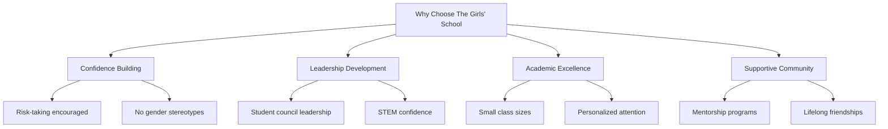
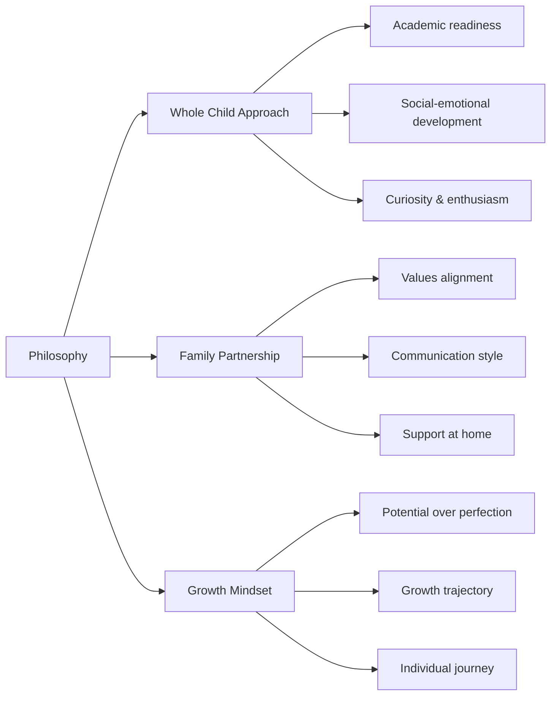
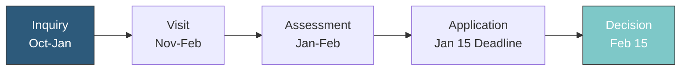

# Admissions Page Redesign Plan

## Overview
Redesign the Admissions page to create a premium, modern, content-rich experience that guides parents through the enrollment journey with confidence and clarity. The design will use the existing blue/teal palette enhanced with cream backgrounds and elegant accents.

## Visual Design Direction
- **Primary Colors**: Blues/teals (#2d5a7b, #4a90a4, #7ec8c8)
- **Backgrounds**: Cream (#f8f9fa, #fdfcfb) for softer contrast
- **Accents**: Coral (#e8a87c) for CTAs and highlights
- **Typography**: Playfair Display for headings, Inter for body
- **Animations**: Elegant, calm, performance-friendly with fade-in/slide-up effects

## New Page Structure

### 1. Animated Intro Section (Below Navbar)
Located after the navbar, replacing the basic hero:

**Content:**
- Headline: "Where Confidence Meets Excellence"
- Subtext: Personalized welcoming message guiding families through the journey
- Animated elements with fade-in and slide-up animations
- Immediate CTAs for Inquiry and Visit

**Animations:**
- Headline: fade-in + slide-up (0.6s)
- Subtext: fade-in + slide-up (0.8s, 0.2s delay)
- CTA buttons: scale-in + fade (1.0s, 0.4s delay)

---

### 2. Why Choose The Girls' School Section (NEW)
Persuasive content highlighting the benefits of an all-girls education:

**Structure:**


**Content Pillars:**
1. **Confidence & Self-Esteem**: Studies show girls in single-sex schools take more academic risks
2. **Leadership Opportunities**: More leadership roles available without competition from boys
3. **Academic Excellence**: Higher achievement scores in STEM and humanities
4. **Supportive Community**: Lasting friendships and mentorship

**Cards with staggered reveal:**
- 4 cards displayed in a 2x2 grid
- Each card has icon, headline, and 2-3 bullet points
- Staggered animation (150ms between cards)

---

### 3. Admissions Philosophy Section (NEW)
Calm, reassuring copy explaining holistic evaluation:

**Structure:**


**Content Approach:**
- Welcoming tone emphasizing "we're looking for the right fit"
- Explains the holistic review process
- Reassures families about diverse pathways
- Animated content blocks that reveal on scroll

**Design:**
- Left: Narrative text with animated reveal
- Right: Icon-based values grid
- Soft cream background

---

### 4. Admissions Process Section (REDESIGNED)
Step-by-step visual flow with animated icons and progressive reveal:

**Revised Steps:**
1. **Inquiry** - Submit online form, receive information
2. **Visit** - Personalized campus tour (required)
3. **Assessment** - Age-appropriate activities
4. **Application** - Complete form + documents
5. **Decision** - Notification within 2 weeks

**Visual Enhancements:**
- Animated icons for each step
- Connecting line with progress animation
- Each step reveals on scroll
- Hover states with subtle lift effect

**Timeline Design:**


---

### 5. Tuition & Financial Aid Section (ENHANCED)
Clear, detailed explanations with well-spaced content panels:

**Structure:**
- **Tuition Panel**: K-5 and 6-8 pricing with included items
- **Financial Aid Panel**: Stats and application info
- **Payment Options**: Plans and schedules
- **FAQ Toggle**: Quick answers to cost questions

**Design Elements:**
- Glass-effect panels with soft shadows
- Animated stat counters (28% receive aid, $2.1M awarded)
- Hover transitions on cards
- Elegant dividers between sections

---

### 6. Visit & Open Houses Section (ENHANCED)
Inviting content encouraging campus visits:

**Content:**
- **Personal Tours**: Schedule option with animated calendar
- **Open House Events**: 3-4 featured events with registration CTAs
- **Virtual Options**: Information about online alternatives

**Design:**
- Event cards with date badges
- Hover animations on cards
- Animated countdown timers for upcoming events
- Staggered reveal of event cards

---

### 7. Life After Graduation Section (NEW)
Expanded storytelling about student outcomes:

**Content Areas:**
- **High School Readiness**: Preparation for top schools
- **Leadership Outcomes**: Examples of student achievements
- **Alumni Network**: Connection to successful graduates
- **Success Stories**: Brief testimonials

**Structure:**
- Left: Animated narrative text
- Right: Success metrics cards
- Bottom: Alumni quote slider

**Metrics to Highlight:**
- 95% acceptance to top-choice high schools
- 100% college preparatory curriculum
- Average SAT scores above national average
- Leadership positions held by graduates

---

### 8. FAQs Section (ANIMATED ACCORDION)
Accordion-style animated sections for common parent questions:

**Questions to Include:**
1. What grades do you accept?
2. Is financial aid available?
3. What is the application deadline?
4. Do you offer before/after school care?
5. What is the class size?
6. How do you handle different learning styles?
7. What extracurricular activities are available?
8. What is the tuition payment schedule?

**Accordion Behavior:**
- Click question to expand answer
- Smooth height animation (300ms)
- Chevron rotation on expand
- Only one open at a time (or multiple - TBD)

**Design:**
- Clean typography for questions
- Smooth answer reveal
- Subtle background change on active state

---

### 9. Apply CTA Section (ENHANCED)
Strong closing call-to-action:

**Content:**
- Headline: "Ready to Begin Your Journey?"
- Supporting text: Brief encouragement
- Primary CTA: "Start Application"
- Secondary CTA: "Contact Admissions"

**Design:**
- Gradient background matching brand
- Animated elements floating
- Hover effects on buttons
- Smooth entrance animation

---

## Animation Strategy

### Entrance Animations
```css
/* Page Load Animations */
@keyframes fadeSlideUp {
    from {
        opacity: 0;
        transform: translateY(40px);
    }
    to {
        opacity: 1;
        transform: translateY(0);
    }
}

@keyframes fadeSlideIn {
    from {
        opacity: 0;
        transform: translateX(-30px);
    }
    to {
        opacity: 1;
        transform: translateX(0);
    }
}

@keyframes scaleFade {
    from {
        opacity: 0;
        transform: scale(0.95);
    }
    to {
        opacity: 1;
        transform: scale(1);
    }
}
```

### Scroll Animations
- **Intersection Observer** for reveal on scroll
- **Staggered delays**: 100-200ms between items
- **Duration**: 0.5-0.8s for smooth feel
- **Threshold**: 0.1 for early reveal

### Micro-interactions
- **Buttons**: Subtle scale on press, lift on hover
- **Cards**: 3D tilt effect, shadow deepening
- **Links**: Underline expansion animation
- **Icons**: Rotation on hover/active states

---

## Responsive Design

### Breakpoints
- **Desktop**: 1200px+
- **Tablet**: 768-1199px
- **Mobile**: <768px

### Adaptations
- Process steps: Horizontal on desktop, vertical on mobile
- Cards: 2x2 grid on tablet, 1 column on mobile
- Accordion: Full width on all breakpoints
- Typography: Clamp functions for fluid sizing

---

## File Changes Summary

### admissions.html
- Add new intro section after navbar
- Add "Why Choose" section before process
- Add Philosophy section
- Redesign Process section with new structure
- Enhance Tuition section
- Enhance Events section
- Add Life After Graduation section
- Convert FAQs to animated accordion
- Enhance Apply CTA section

### css/admissions.css
- New section styles with cream backgrounds
- Card designs with hover effects
- Process flow visualization styles
- Accordion styles for FAQs
- Premium micro-interactions
- Responsive adaptations

### js/animations.js
- New animation triggers for all sections
- Staggered reveal function
- Accordion toggle functionality
- Counter animations for stats
- Smooth scroll behaviors

---

## Implementation Priority

1. **High Priority** (Core functionality):
   - Intro section animations
   - Process flow redesign
   - FAQ accordion
   - Apply CTA

2. **Medium Priority** (Content enhancement):
   - Why Choose section
   - Philosophy section
   - Tuition section enhancement
   - Events section enhancement

3. **Low Priority** (Polish):
   - Life After Graduation section
   - Advanced micro-interactions
   - Performance optimization

---

## Success Metrics
- [ ] All sections load with smooth animations
- [ ] FAQ accordion functions smoothly
- [ ] Responsive layout works on all devices
- [ ] Page performance remains fast (<3s load)
- [ ] Accessibility maintained (keyboard nav for accordion)
